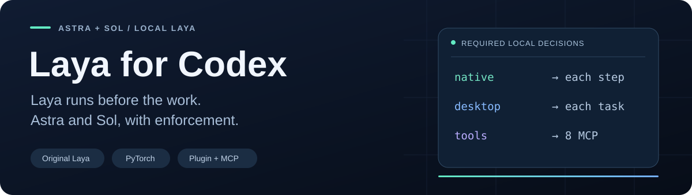

<p align="center">
  
</p>

<p align="center">
  <a href="https://github.com/ahmadjehad2000/laya/actions/workflows/codex-companion.yml"></a>
  
  
  <a href="LICENSE"></a>
  <a href="https://github.com/ahmadjehad2000/laya/releases"></a>
</p>

<p align="center">
  <strong>Keep bulk classification and conversation handoffs local. Spend Codex context on the work that needs it.</strong><br />
  Built directly on the original <a href="https://github.com/NandhaKishorM/laya">Laya</a>, with PyTorch, a Codex plugin, and MCP.
</p>

<p align="center">
  <a href="#quickstart">Quickstart</a> ·
  <a href="#workflows">Workflows</a> ·
  <a href="#cost-control">Cost control</a> ·
  <a href="#benchmarks">Benchmarks</a> ·
  <a href="#tuning-and-practical-recipes">Tuning recipes</a> ·
  <a href="integrations/codex/docs/API.md">API</a> ·
  <a href="integrations/codex/docs/VERIFICATION.md">Test evidence</a> ·
  <a href="UPSTREAM_README.md">Original Laya docs</a>
</p>

---

Laya for Codex brings small, typed decisions into your existing Codex session. Send a workspace file path to the local model and get counts, review exceptions and a result artifact. For exported conversations, create a reversible local handoff before continuing in a new Codex thread. The original PyTorch model supplies classification; deterministic code handles conversation extraction.

**Preview:** the integration passed real inference tests on Windows, Linux, and macOS CPU, plus Windows CUDA. Model accuracy has clear limits: our small synthetic evaluation matched **17 of 24 decisions**. Read [what is verified](#verification) before choosing a workflow.

## Cost control

**Measured feasibility: 79.8% fewer Codex input tokens on one long-history recall test.**

| Controlled pilot | Baseline | Local-first path | Observed quality |
| :--- | ---: | ---: | :--- |
| Conversation handoff | 84,355 input tokens | 17,001 input tokens | Same five requested facts retained |
| 20 public news classifications | 14,980 input + 197 output tokens | Zero cloud calls for local classification | Both 19/20; Laya flagged its wrong answer for review |

The handoff comparison used the same Codex model (`gpt-5.6-sol`), low reasoning,
and fresh CLI threads; both reported zero cached input tokens and 49 output tokens.
This is a small feasibility pilot, **not a universal cost or subscription-quota claim**.
The zero-cloud classification measurement excludes Codex orchestration and review.

- **Bulk files:** `laya_classify_file` reads local `{id,state}` JSON records and returns a compact report. Avoid putting the full dataset into Codex first.
- **Conversation handoffs:** `laya_compact_file` archives older bulky tool output, preserves messages, and makes a new-thread context with exact retrieval.
- **Native compaction:** the current plugin cannot replace Codex's internal compaction. No global interception or compaction-blocking hook is installed. `laya-for-codex continue` starts a new CLI thread from the local handoff.

[How to use it, limits, and reproducible commands](integrations/codex/docs/COST_CONTROL.md) ·
[Raw Codex usage evidence](integrations/codex/evidence/cost-pilot-windows.json)

## Workflows

| Bring to Codex | Ask Laya to help with | Keep Codex responsible for |
| :--- | :--- | :--- |
| Natural-language issues and log summaries | Repeated category or team routing | Checking labels against the original issue |
| English, Arabic, or mixed-language tickets | Topic and intent classification | Resolving ambiguity, negation, and missing evidence |
| Document excerpts and research records | Consistent tagging across a collection | Preserving evidence and reviewing outliers |
| Comparable records and an explicit rubric | Ordered rubric scoring | Explaining scores and validating consequential decisions |

Four included skills cover **developer triage**, **record triage**, **rubric scoring**, and **diagnostics**. Laya is optional; ordinary coding and reasoning continue normally. Raw-code role classification performed poorly in testing and is excluded from recommended workflows.

## Quickstart

You need a local Codex client, **64-bit Python 3.12 or 3.13**, several GB of free disk, and preferably **16 GB+ RAM**. The checkpoint-aware cold-load estimate is about **2.55 GiB available RAM for multilingual** or **3.10 GiB for English/typed-decisions** with default reserves. These are preflight estimates, not peak-memory guarantees. Setup downloads packages and weights; prepared inference runs offline.

```sh
git clone https://github.com/ahmadjehad2000/laya.git
cd laya/integrations/codex
```

<details open>
<summary><strong>Windows · NVIDIA GPU</strong></summary>

```powershell
py -3.12 bootstrap.py install --torch-index cu128 --device cuda
```

Requires a compatible NVIDIA driver and a real CUDA prediction before setup succeeds.
Later inference can report CPU fallback if GPU availability or memory changes.

</details>

<details>
<summary><strong>Windows · CPU</strong></summary>

```powershell
py -3.12 bootstrap.py install --torch-index cpu --device cpu
```

</details>

<details>
<summary><strong>Linux · CPU</strong></summary>

```sh
python3 bootstrap.py install --torch-index cpu --device cpu
```

Use a Python 3.12 or 3.13 interpreter. For NVIDIA acceleration, use the CUDA setup below.

</details>

<details>
<summary><strong>Linux · NVIDIA CUDA, including Debian WSL2</strong></summary>

```sh
python3 bootstrap.py install --torch-index cu128 --device cuda
```

Use `--mode none` for a Linux inference environment without a local Codex CLI.
Inside WSL2, use the GPU driver supplied by Windows; do not install a Linux display
driver over its mapping. Follow the [Linux CUDA / WSL2 guide](integrations/codex/docs/LINUX_CUDA.md)
for driver checks, strict GPU acceptance, and Windows Codex → Debian MCP configuration.
See the verification table for tested versus unverified hardware paths.

</details>

<details>
<summary><strong>macOS · CPU</strong></summary>

```sh
python3 bootstrap.py install --device cpu
```

Use native ARM64 Python 3.12 on Apple Silicon. ARM64 CPU inference is verified. Apple MPS is selectable with `--device mps`, but remains experimental and unverified.

</details>

The installer creates an isolated environment under `~/.laya-for-codex`, prepares the pinned multilingual checkpoint, runs a real prediction, and installs the Codex plugin with an absolute executable path. No model API key is needed.

Open a **new Codex session**, then try:

> Use Laya to classify these two tickets as billing, technical, or other: “I was charged twice” and “تم خصم المبلغ مرتين”. Show the actual device and verify each label against the text.

If you already have an older managed Laya integration, first install with `--mode none`, then run `python3 bootstrap.py register --mode plugin --migrate-existing` (`py -3.12` on Windows). The installer backs up the configuration and preserves unrelated settings. See [setup, repair, direct MCP, and rollback](integrations/codex/README.md).

The verified plugin path uses Codex CLI 0.155.1's compatibility manifest. Local clients without plugin support can use `--mode direct`. Hosted Codex cannot access this desktop installation. The portable plugin ZIP is an alternate distribution for compatible hosts; it is not the verified installation path and still needs the prepared CLI on PATH.

## How it fits into Codex


| Tool | Purpose |
| :--- | :--- |
| `laya_status` | Inspect readiness, actual device, loaded model, and resource counters |
| `laya_predict` | Ask related `choice`, `score`, or `noul` questions over one state |
| `laya_predict_batch` | Apply shared questions to up to 32 independent records |
| `laya_classify_file` | Classify up to 1,000 local JSON records by file reference; return counts and review exceptions |
| `laya_compact_file` | Create a reversible local conversation handoff for a new thread |
| `laya_release` | Unload the model and clear in-memory caches |
| `laya_benchmark` | Run an explicitly requested synthetic performance diagnostic |

Requests are validated, bounded, and checked for tokenizer truncation. Repeated identical requests can use a bounded memory cache. Batch processing preserves record order and reports individual failures. It reduces tool round trips; model inference remains sequential.

See the [API contract](integrations/codex/docs/API.md) and [example request](integrations/codex/examples/quickstart.json). A `score` result is a zero-based expected rubric index, potentially fractional, from 0 to N−1 for N entries; it is not automatically a percentage. Probabilities and confidence never authorize actions.

## Original Laya, with explicit model selection

| Selection | Checkpoint behavior |
| :--- | :--- |
| `multilingual` | Default; English, Arabic, and mixed-language workflows |
| `english` | Original English checkpoint |
| `typed-decisions` | Explicit opt-in to the upstream typed-decisions checkpoint |
| `auto` | Upstream language routing; reported fallback to prepared multilingual if English exceeds the RAM estimate |

Prepare every checkpoint when needed:

```sh
python3 bootstrap.py prepare --model all
```

Checkpoint revisions and SHA-256 hashes are [pinned](integrations/codex/laya_codex_companion/models.json). Preparation verifies weights; inference never downloads missing files. Each MCP server keeps at most one model resident, unloads before switching models, and releases idle model memory. Separate Codex processes can each hold a model.

This fork uses the **original Laya Router and Agent with PyTorch**. It contains no Laya-MLX runtime or dependency. The upstream Python API remains available; its documentation is preserved in [UPSTREAM_README.md](UPSTREAM_README.md).

## Verification

| Check | Result |
| :--- | :--- |
| Companion validation, memory policy, file offload, local handoffs, setup, and rollback | 70 automated tests passed |
| Upstream routing / criteria contracts | 106 / 34 checks passed |
| Fresh installation and real MCP inference | Windows CPU, Linux CPU, macOS ARM64 CPU passed |
| Local GPU inference | Windows CUDA passed |
| Actual plugin use in a fresh Codex session | Status → English/Arabic batch → release passed |
| Checkpoint loading and routing | All three checkpoints + automatic English/Arabic selection passed |
| Apple MPS / Linux CUDA / Intel macOS | Not verified |

[Cross-platform real-inference run](https://github.com/ahmadjehad2000/laya/actions/runs/35717300148) · [Detailed reports and methodology](integrations/codex/docs/VERIFICATION.md)

**Transport correctness and model accuracy are separate.** The version 2 synthetic fixture matched **17/24** expected decisions: software issues 3/4, raw-code roles 1/4, ticket decisions 9/12, and document categories 4/4. Failures included sales-versus-billing ambiguity, explicit refund negation, and insufficient evidence. Raw-code roles remain in the fixture to expose the weakness, not to endorse the use case.

These are small, manually labeled acceptance cases, not broad accuracy, calibrated confidence, or speed claims. Review consequential predictions against source evidence.

## Benchmarks

A portable benchmark suite measures public classification, the three Laya primitives,
real MCP latency, cold starts, caching, and batching. The protocol is reproducible across
supported hardware; the measurements below belong to the named machine and workload.
They are not universal speed or accuracy guarantees.

Measured on an **Intel Core i7-13620H / RTX 4060 Laptop GPU (8 GB VRAM)**, using the pinned
multilingual checkpoint, four CPU threads, and PyTorch `2.11.0+cu128`. These were sequential
profiles on an interactive workstation, with background activity rather than laboratory
isolation. The fixed short/medium/long inputs used **49 / 147 / 371 context tokens**.

<!-- BENCHMARK_TABLE_START -->

| Measurement | Windows CPU | Windows CUDA |
| :--- | ---: | ---: |
| AG News subset accuracy | 191/200 (95.5%) | 191/200 (95.5%) |
| AG News macro-F1 | 0.9547 | 0.9547 |
| Synthetic workflow decisions | 17/24 | 17/24 |
| Synthetic rubric rounded accuracy | 4/12 | 4/12 |
| Rubric MAE (0–3 index; lower is better) | 0.821 | 0.820 |
| Fresh server init + first request, median (3 runs) | 11.97 s | 13.30 s |
| Warm short MCP request, p50 / p95 | 114.4 / 156.3 ms | 27.3 / 39.3 ms |
| Warm medium MCP request, p50 / p95 | 230.4 / 267.5 ms | 28.1 / 37.5 ms |
| Warm long MCP request, p50 / p95 | 568.7 / 657.6 ms | 28.3 / 38.7 ms |
| Exact cache hit, p50 | 2.20 ms | 1.70 ms |
| 8-record batch throughput | 8.6 records/s | 39.0 records/s |
| Three related questions, p50 | 208.1 ms | 27.4 ms |
| Resident server RSS snapshot (not peak) | 1.92 GiB | 1.91 GiB |

<!-- BENCHMARK_TABLE_END -->

Each warm latency row uses **30 uncached requests after 3 warm-ups**. Cold startup uses
3 fresh server processes without flushing the OS file cache. Batch throughput uses
5 eight-record calls; records run sequentially. The cache row measures result reuse,
not fresh model inference. MCP timing excludes Codex's reasoning and tool-selection time.

**Quality is task-specific.** AG News uses a fixed balanced 200-record sample of the public
7,600-record test set, selected with seed 1729. The 95.5% result is for that subset,
not the full benchmark or a general reliability score. The same model still matched only
17/24 synthetic workflow decisions and 4/12 rounded severity scores. The rubric MAE uses
a 0–3 index; lower is better. No broad confidence-calibration or autonomous-action claim
follows from these results.

[Protocol, dataset provenance, and metric definitions](integrations/codex/benchmarks/README.md) ·
[Windows CPU report](integrations/codex/evidence/benchmark-windows-cpu.json) ·
[Windows CUDA report](integrations/codex/evidence/benchmark-windows-cuda.json)

To reproduce from the repository root with the prepared companion environment activated:

```sh
python integrations/codex/benchmarks/ag_news.py
python integrations/codex/benchmarks/run.py --device cuda --output dist/benchmark-cuda.json
python integrations/codex/benchmarks/run.py --device cpu --output dist/benchmark-cpu.json
python integrations/codex/benchmarks/summarize.py dist/benchmark-cpu.json dist/benchmark-cuda.json
```

The dataset is explicitly downloaded and checksum-verified. Inference remains offline.
Use `--model english` or `--model typed-decisions` for a separate model profile, or
`--per-class 1900` to evaluate the full test set. Requested GPU runs fail if inference
actually falls back to CPU. Raw reports retain timings, row IDs, errors, source hashes,
model revision, hardware, and package versions; missing results are never silently dropped.

## Tuning and practical recipes

These are the actual settings and implementation lessons behind this companion. The
defaults and platform results above are tested; alternative tuning values below are
starting points to measure on your own workload, not hidden switches or promised speedups.

### Make the GPU the default in Codex

The Windows NVIDIA install command above installs the CUDA 12.8 PyTorch build and writes
`"device": "cuda"` to `~/.laya-for-codex/config.json`. The installed plugin reads that
configuration automatically. On an existing GPU installation, change just `device` in
that file, preserving your other settings, and open a new Codex session. No model
redownload or plugin rebuild is needed for a device-only change.

```json
{
  "device": "cuda",
  "model": "multilingual"
}
```

Unspecified settings use the defaults below. `LAYA_COMPANION_DEVICE` and
`LAYA_COMPANION_MODEL` override the file when present **in the server process's
environment**; changing a terminal variable does not reconfigure an already running
Codex app. `LAYA_COMPANION_HOME` selects a separate runtime/configuration directory.

Verify the prepared Windows runtime directly:

```powershell
& "$env:USERPROFILE/.laya-for-codex/venv/Scripts/python.exe" -c "import torch; print(torch.__version__, torch.cuda.is_available()); print(torch.cuda.get_device_name(0) if torch.cuda.is_available() else 'CPU only')"
```

Then ask Codex:

> Use Laya status, classify “I was charged twice” as billing, technical, or other, and report the configured device, actual runtime.device, and fallback_reason. Release the model afterward.

`laya_status.device` is null before inference; it does not prove GPU failure. Read the
prediction's `runtime.device`. CUDA selection remains a preference: unavailable CUDA or
insufficient free VRAM can cause CPU fallback, which is reported. Our local validation
used an RTX 4060 Laptop GPU with 8 GB VRAM and PyTorch `2.11.0+cu128`; this is an observed
working setup, not a universal minimum requirement.

### Know the knobs before changing them

Edit `~/.laya-for-codex/config.json`, retaining the fields you need, then start a new
server/session. Values outside the supported ranges are rejected.

| Setting | Default | Supported range / practical effect |
| :--- | :--- | :--- |
| `device` | `auto` | `auto`, `cuda`, `cpu`, `mps`; installer `--device` sets your preference |
| `model` | `multilingual` | `multilingual`, `english`, `typed-decisions`, `auto` |
| `question_batch_size` | `4` | 1–16 related questions per upstream call; try 1–2 if memory is tight |
| `max_questions` | `16` | 1–32 questions per request; this is a validation limit |
| `max_items` | `32` | 1–128 independent records per batch; records still run sequentially |
| `max_request_bytes` | `131072` | 1024–1048576 serialized UTF-8 bytes; does not expand model context |
| `cache_entries` | `128` | 0–1024; zero disables storing answers |
| `cache_ttl_sec` | `120` | 0–3600 seconds; zero disables storing answers |
| `idle_unload_sec` | `600` | 1–86400 seconds; shorter frees memory sooner, longer keeps the model warm |
| `min_free_ram_gib` | `1.0` | 0.5–128 GiB; explicit lower bound on the checkpoint-aware cold-load estimate |
| `min_free_vram_gib` | `2.5` | 0.5–128 GiB; CUDA preflight, not a model-size guarantee |
| `memory_reserve_gib` | `0.75` | 0.5–128 GiB; extra headroom added to cold-load estimates and checked for warm requests |
| `threads` | `4` | 1–32 PyTorch CPU threads; more threads are not always faster |

For a GPU desktop, start with `device: cuda`, the multilingual model, and the other
defaults. For shared or constrained hardware, try `question_batch_size: 1` and
`idle_unload_sec: 120`, then check actual memory use and timings. These alternative
values have not been benchmarked as a faster preset. Raising `max_items` increases work
per tool call, not GPU parallelism.

The old fixed 4.5 GiB gate has been replaced. All modes—CPU, CUDA, MPS, and auto—now
estimate cold host memory from **checkpoint bytes + FP32 parameter bytes + reserve**,
then honor any higher explicit `min_free_ram_gib`. Laya constructs FP32 parameters on
the host even for GPU inference. CUDA also checks its own free VRAM estimate; MPS
shares system memory. Warm requests check the reserve, not the full cold-load budget.
Checkpoint switches release the old model before measuring available RAM.

`laya_status` exposes each checkpoint's estimate. With these pinned weights,
**multilingual is smaller than English**, so switching to English is not a reliable
memory fix. Windows CPU and CUDA cold loads have now succeeded below the previous
4.5 GiB threshold. If a config explicitly contains `min_free_ram_gib: 4.5`, that
user-specified floor is preserved; remove that override or choose a justified lower
bound after updating the runtime to use the adaptive estimate.

With `model: auto`, a routed English checkpoint that exceeds available RAM can fall
back to the smaller **prepared** multilingual checkpoint when it fits. The result
records `routing.memory_fallback`, including the original estimate. Explicit model
requests never switch checkpoints this way; no path silently downloads a smaller model.

An actual shortage returns a retryable `memory_pressure` batch error with the available
and required RAM, and **no fabricated prediction**. Release unused model sessions or
apps before retrying. The estimates cannot guarantee against every native allocation
failure; load/inference memory failures still clean up resident model state. Do not
reduce reserves to hide real resource pressure.

### Spend fewer tool calls and avoid unnecessary loads

1. Put related `choice`, `score`, and `noul` questions over the **same evidence** in one
   `laya_predict` call. Use short instructions and clear label descriptions.
2. Use `laya_predict_batch` for independent records with shared questions. Keep stable
   item IDs and map source references outside the model state. Do not combine unrelated
   tickets into one evidence block.
3. Keep the same checkpoint through a run when appropriate. A server retains only one
   model; changing models unloads the previous one before loading the next. Grouping
   English and Arabic records can reduce switching when using `auto`; using the
   multilingual checkpoint throughout avoids language-driven switches.
4. Keep the model warm during a batch of work. Release it when finished; calling
   `laya_release` between every record forces repeated cold loads and clears the cache.

The answer cache matches the exact state, ordered questions, selected checkpoint, and
pinned revision. It is memory-only. Changed wording or question order can miss the
cache. Use `use_cache: false` when checking fresh inference. A cache hit reports zero
new load/inference time and keeps the earlier measurements under `original_runtime`;
it does not mean the model performed a zero-millisecond forward pass.

### Better labels come from better evidence and criteria

> Use Laya for the repeated labels in these records. Preserve IDs, batch shared questions, use concise source excerpts, and return the supporting evidence with each label. Review negation, ambiguous billing/sales cases, and insufficient information yourself. Do not treat confidence as proof.

Include enough context to support the decision, but avoid pasting a whole repository
or long document. The tokenizer checks the combined state, instructions, and options;
the pinned checkpoint's context is small. Increasing the byte limit does not increase
its token window. A truncation error means split the records or make an evidence-based
summary, preserving negations and qualifiers.

Use distinct label descriptions, and add an `unknown`/`needs_review` option when suitable.
This does not guarantee correct abstention: our insufficient-evidence case still failed.
For scores, order the rubric from low to high and interpret the returned index using
its legend. For `noul`, ask one explicit proposition. Raw-code role inference remains
outside the recommended workflows. High confidence and `act_probability` never grant
execution permission.

### Prepare models once, then work offline

Run these commands from `integrations/codex` (`py -3.12` instead of `python3` on Windows):

```sh
python3 bootstrap.py prepare --model all
python3 bootstrap.py doctor
```

The default model stays multilingual after preparing all checkpoints. Set `model` to
`auto` only when you want upstream language routing; it needs both English and
multilingual checkpoints prepared. `typed-decisions` is always explicit opt-in.

To reuse an existing Hugging Face cache without downloading, run the prepared CLI's
`prepare --model multilingual --source-cache <cache-directory>` command. For Windows:

```powershell
& "$env:USERPROFILE/.laya-for-codex/venv/Scripts/laya-for-codex.exe" prepare --model multilingual --source-cache "$env:USERPROFILE/.cache/huggingface/hub"
```

The exact pinned snapshot must already exist there. Setup copies it into the companion's
own checkpoint directory before tokenizer fixes and verifies the weight hash. Normal
preparation streams weights over HTTPS into a temporary file and only promotes a
checksum-verified download. This avoids the Xet downloader stall encountered during
development. Missing weights are never fetched by an inference call.

### Codex integration fixes worth keeping

| Symptom or constraint | What this companion does / what to check |
| :--- | :--- |
| Plugin appears installed but tools are absent | Uses the compatibility `.codex-plugin/plugin.json` entrypoint verified with CLI 0.155.1; the portable ZIP is a separate, unverified host path |
| Tools disappear after removal or configuration changes | Run `bootstrap.py register --mode plugin`, then open a new session; registration performs a real prediction first |
| Executable is missing from Codex's PATH | Installer materializes an absolute runtime path; no activated terminal is required |
| Old and new Laya registrations collide | Test with `--mode none`, then use deliberate `register --mode plugin --migrate-existing`; unmanaged collisions are refused |
| Slow first request | Cold loading is separate from warm inference; direct MCP registration sets a 300-second tool timeout, while the plugin uses host defaults |
| Windows native initialization or corrupted MCP messages | Server initializes NumPy before worker threads and routes upstream stdout to stderr, preserving protocol stdout |
| Windows package build cannot read Unicode README text | Upstream packaging reads README explicitly as UTF-8 |
| Multiple sessions consume GPU memory | Each MCP process can hold a model; use `laya_release` or finish unused sessions |
| Config changed after install | Guarded rollback refuses to overwrite later edits; retain the backup for a targeted restore |

For a local client requiring direct MCP, use `--mode direct` after disconnecting the
plugin to avoid duplicate servers. A new Codex session is the boundary for loading new
skills, plugin assets, and server configuration. The companion is a tool inside Codex;
it does not move Codex's main reasoning model onto your GPU.

For plugin metadata or skill development, edit the source files, run
`python3 scripts/build_plugin.py` when changing the shared manifest metadata, then
`python3 bootstrap.py register --mode plugin` from `integrations/codex`. Registration
copies the source plugin into the local marketplace and adds a fresh cache version so
Codex picks up the changes. Runtime Python changes require rerunning `install` to update
the isolated package; changing source files alone does not update that installed copy.

### Measure the part you are actually changing

Only request `laya_benchmark` when performance tuning is relevant. It runs 3–10 small
synthetic predictions with answer caching disabled. Compare cold `load_ms`, warm
`inference_ms`, actual device, and fallback reason separately. `elapsed_ms` excludes
lock waiting and MCP/Codex overhead, so it is not end-to-end conversation latency.
The bundled timing diagnostic does not establish model accuracy. Keep quality checks
separate using [the labeled fixture and recorded disagreements](integrations/codex/docs/VERIFICATION.md).

## Privacy and control

- Inference runs locally over stdio, with no listening network port.
- Setup downloads dependencies and public model weights. Prepared inference is offline.
- The companion does not write raw prompts to disk or upload them. Results returned to Codex enter its conversation and normal data handling.
- Configuration controls the device, model, request limits, cache, threads, and idle timeout.
- Uninstall disconnects the integration while retaining weights and backups. Guarded rollback restores the saved configuration when it has not subsequently changed.

## Develop and contribute

```sh
python -m pip install -r integrations/codex/requirements.lock
python -m pip install --no-deps -e .
python -m pip install -e 'integrations/codex[test]'
python -m pytest integrations/codex/tests -q
python tests/test_router.py
python tests/test_criteria.py
```

The companion lives in [`integrations/codex`](integrations/codex). Real-model checks, native Codex acceptance, plugin packaging, and the labeled evaluation are documented there. Report integration errors separately from prediction disagreements when opening an [issue](https://github.com/ahmadjehad2000/laya/issues).

## Credits and license

An independent integration by [ahmadjehad2000](https://github.com/ahmadjehad2000), built as a direct fork of [NandhaKishorM/laya](https://github.com/NandhaKishorM/laya). Credit for Laya, its models, and upstream research belongs to the original authors. This is not an official OpenAI or Convai Innovations product.

[Apache 2.0](LICENSE) · [Attribution notice](integrations/codex/NOTICE) · [Original project documentation](UPSTREAM_README.md)
