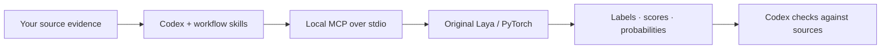

<p align="center">
  
</p>

<p align="center">
  <a href="https://github.com/ahmadjehad2000/laya/actions/workflows/codex-companion.yml"></a>
  
  
  <a href="LICENSE"></a>
  <a href="https://github.com/ahmadjehad2000/laya/releases"></a>
</p>

<p align="center">
  <strong>Give Codex a local decision engine for repeated classification, routing, and rubric scoring.</strong><br />
  Built directly on the original <a href="https://github.com/NandhaKishorM/laya">Laya</a>, with PyTorch, a Codex plugin, and MCP.
</p>

<p align="center">
  <a href="#quickstart">Quickstart</a> ·
  <a href="#workflows">Workflows</a> ·
  <a href="integrations/codex/docs/API.md">API</a> ·
  <a href="integrations/codex/docs/VERIFICATION.md">Test evidence</a> ·
  <a href="UPSTREAM_README.md">Original Laya docs</a>
</p>

---

Laya for Codex brings small, typed decisions into your existing Codex session. Codex gathers the relevant evidence, sends related questions to a local model, and checks the results against your sources. You get structured labels, rubric scores, and yes/no probabilities without running a separate model service.

**Preview:** the integration passed real inference tests on Windows, Linux, and macOS CPU, plus Windows CUDA. Model accuracy has clear limits: our small synthetic evaluation matched **17 of 24 decisions**. Read [what is verified](#verification) before choosing a workflow.

## Workflows

| Bring to Codex | Ask Laya to help with | Keep Codex responsible for |
| :--- | :--- | :--- |
| Natural-language issues and log summaries | Repeated category or team routing | Checking labels against the original issue |
| English, Arabic, or mixed-language tickets | Topic and intent classification | Resolving ambiguity, negation, and missing evidence |
| Document excerpts and research records | Consistent tagging across a collection | Preserving evidence and reviewing outliers |
| Comparable records and an explicit rubric | Ordered rubric scoring | Explaining scores and validating consequential decisions |

Four included skills cover **developer triage**, **record triage**, **rubric scoring**, and **diagnostics**. Laya is optional; ordinary coding and reasoning continue normally. Raw-code role classification performed poorly in testing and is excluded from recommended workflows.

## Quickstart

You need a local Codex client, **64-bit Python 3.12** (3.13 is supported by the package but not the tested CI version), several GB of free disk, and preferably **16 GB+ RAM**. The default cold-load check requires 4.5 GiB of available RAM. Setup downloads packages and weights; prepared inference runs offline.

```sh
git clone https://github.com/ahmadjehad2000/laya.git
cd laya/integrations/codex
```

<details open>
<summary><strong>Windows · NVIDIA GPU</strong></summary>

```powershell
py -3.12 bootstrap.py install --torch-index cu128
```

Uses PyTorch CUDA when available and reports the actual device. A compatible NVIDIA driver is required for CUDA; the runtime can fall back to CPU.

</details>

<details>
<summary><strong>Windows · CPU</strong></summary>

```powershell
py -3.12 bootstrap.py install --torch-index cpu --device cpu
```

</details>

<details>
<summary><strong>Linux · CPU</strong></summary>

```sh
python3 bootstrap.py install --torch-index cpu --device cpu
```

Use a Python 3.12 interpreter. NVIDIA users can choose `--torch-index cu128`; Linux CUDA has not been exercised in this release.

</details>

<details>
<summary><strong>macOS · CPU</strong></summary>

```sh
python3 bootstrap.py install --device cpu
```

Use native ARM64 Python 3.12 on Apple Silicon. ARM64 CPU inference is verified. Apple MPS is selectable with `--device mps`, but remains experimental and unverified.

</details>

The installer creates an isolated environment under `~/.laya-for-codex`, prepares the pinned multilingual checkpoint, runs a real prediction, and installs the Codex plugin with an absolute executable path. No model API key is needed.

Open a **new Codex session**, then try:

> Use Laya to classify these two tickets as billing, technical, or other: “I was charged twice” and “تم خصم المبلغ مرتين”. Show the actual device and verify each label against the text.

If you already have an older managed Laya integration, first install with `--mode none`, then run `python3 bootstrap.py register --mode plugin --migrate-existing` (`py -3.12` on Windows). The installer backs up the configuration and preserves unrelated settings. See [setup, repair, direct MCP, and rollback](integrations/codex/README.md).

The verified plugin path uses Codex CLI 0.155.1's compatibility manifest. Local clients without plugin support can use `--mode direct`. Hosted Codex cannot access this desktop installation. The portable plugin ZIP is an alternate distribution for compatible hosts; it is not the verified installation path and still needs the prepared CLI on PATH.

## How it fits into Codex



| Tool | Purpose |
| :--- | :--- |
| `laya_status` | Inspect readiness, actual device, loaded model, and resource counters |
| `laya_predict` | Ask related `choice`, `score`, or `noul` questions over one state |
| `laya_predict_batch` | Apply shared questions to up to 32 independent records |
| `laya_release` | Unload the model and clear in-memory caches |
| `laya_benchmark` | Run an explicitly requested synthetic performance diagnostic |

Requests are validated, bounded, and checked for tokenizer truncation. Repeated identical requests can use a bounded memory cache. Batch processing preserves record order and reports individual failures. It reduces tool round trips; model inference remains sequential.

See the [API contract](integrations/codex/docs/API.md) and [example request](integrations/codex/examples/quickstart.json). A `score` result uses the API's fractional scale; it is not automatically a percentage. Probabilities and confidence never authorize actions.

## Original Laya, with explicit model selection

| Selection | Checkpoint behavior |
| :--- | :--- |
| `multilingual` | Default; English, Arabic, and mixed-language workflows |
| `english` | Original English checkpoint |
| `typed-decisions` | Explicit opt-in to the upstream typed-decisions checkpoint |
| `auto` | Upstream language routing between prepared English and multilingual models |

Prepare every checkpoint when needed:

```sh
python3 bootstrap.py prepare --model all
```

Checkpoint revisions and SHA-256 hashes are [pinned](integrations/codex/laya_codex_companion/models.json). Preparation verifies weights; inference never downloads missing files. Each MCP server keeps at most one model resident, unloads before switching models, and releases idle model memory. Separate Codex processes can each hold a model.

This fork uses the **original Laya Router and Agent with PyTorch**. It contains no Laya-MLX runtime or dependency. The upstream Python API remains available; its documentation is preserved in [UPSTREAM_README.md](UPSTREAM_README.md).

## Verification

| Check | Result |
| :--- | :--- |
| Companion validation, cache, batch behavior, setup, and rollback | 29 automated tests passed |
| Upstream routing / criteria contracts | 106 / 34 checks passed |
| Fresh installation and real MCP inference | Windows CPU, Linux CPU, macOS ARM64 CPU passed |
| Local GPU inference | Windows CUDA passed |
| Actual plugin use in a fresh Codex session | Status → English/Arabic batch → release passed |
| Checkpoint loading and routing | All three checkpoints + automatic English/Arabic selection passed |
| Apple MPS / Linux CUDA / Intel macOS | Not verified |

[Cross-platform real-inference run](https://github.com/ahmadjehad2000/laya/actions/runs/35717300148) · [Detailed reports and methodology](integrations/codex/docs/VERIFICATION.md)

**Transport correctness and model accuracy are separate.** The version 2 synthetic fixture matched **17/24** expected decisions: software issues 3/4, raw-code roles 1/4, ticket decisions 9/12, and document categories 4/4. Failures included sales-versus-billing ambiguity, explicit refund negation, and insufficient evidence. Raw-code roles remain in the fixture to expose the weakness, not to endorse the use case.

These are small, manually labeled acceptance cases, not broad accuracy, calibrated confidence, or speed claims. Review consequential predictions against source evidence.

## Privacy and control

- Inference runs locally over stdio, with no listening network port.
- Setup downloads dependencies and public model weights. Prepared inference is offline.
- The companion does not write raw prompts to disk or upload them. Results returned to Codex enter its conversation and normal data handling.
- Configuration controls the device, model, request limits, cache, threads, and idle timeout.
- Uninstall disconnects the integration while retaining weights and backups. Guarded rollback restores the saved configuration when it has not subsequently changed.

## Develop and contribute

```sh
python -m pip install -r integrations/codex/requirements.lock
python -m pip install --no-deps -e .
python -m pip install -e 'integrations/codex[test]'
python -m pytest integrations/codex/tests -q
python tests/test_router.py
python tests/test_criteria.py
```

The companion lives in [`integrations/codex`](integrations/codex). Real-model checks, native Codex acceptance, plugin packaging, and the labeled evaluation are documented there. Report integration errors separately from prediction disagreements when opening an [issue](https://github.com/ahmadjehad2000/laya/issues).

## Credits and license

An independent integration by [ahmadjehad2000](https://github.com/ahmadjehad2000), built as a direct fork of [NandhaKishorM/laya](https://github.com/NandhaKishorM/laya). Credit for Laya, its models, and upstream research belongs to the original authors. This is not an official OpenAI or Convai Innovations product.

[Apache 2.0](LICENSE) · [Attribution notice](integrations/codex/NOTICE) · [Original project documentation](UPSTREAM_README.md)
